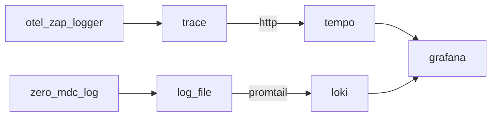

# otel_zero

#### 介绍
集合[otel_zap_logger](https://github.com/Himan000/otel_zap_logger)和[zero_mdc_log](https://github.com/Himan000/zero_mdc_log)。使用`opentelemery`产生`trace`，使用[zerolog](https://github.com/rs/zerolog)产生`log`，`traceID`在代码间的传递通过`MDC（Mapped Diagnostic Context）`进行传递，避免使用`context`进行传递， `MDC`是协程安全的。后续的`trace`和`log`可以发送到`tempo`和`loki`，并且通过`traceID`可以在`grafana`显示`trace`和`log`的关联。本代码只包含`trace`和`log`的产生及发送，未包含`promtail`、`tempo`、`loki`、`grafana`的安装部署。

#### 软件架构


#### 组件说明

- [Grafana](https://grafana.com/) 是一款采用` go` 语言编写的开源应用,是一个跨平台的开源的度量分析和可视化工具。
- [Tempo](https://grafana.com/oss/tempo/) 一个开源的、易于使用的、大规模的分布式跟踪服务端，支持常见的开源跟踪协议，包括`Jaeger`、`Zipkin `和` Open Telemetry`。
- [Loki](https://grafana.com/oss/loki/) Loki 是一个受 `Prometheus` 启发的水平可扩展、高可用、多租户日志聚合系统（比`Elastic`简单，不索引日志内容）。
- [OpenTelemetry](https://opentelemetry.io/) 一个简单的、高度可扩展的、高性能的日志追踪框架（准确来说是标准协议，本身不提供存储，需要其他组件支持比如 `Loki`、`Jaeger`、 `Prometheus`、`SkyWalking`等）。
- [otel_zap_logger](https://github.com/Himan000/otel_zap_logger) 一个[opentelemetry-go](https://github.com/open-telemetry/opentelemetry-go)和`zap`日志的封装，此处只用到了`opentelemetry`。
- [zero_mdc_log](https://github.com/Himan000/zero_mdc_log) [zerolog](https://github.com/rs/zerolog)和MDC的封装。

#### 使用说明

以下是使用的例子，作为参考。

`main.go`

```go
package main

import (
	"net/http"
	"otel_zero_test/pkg/config"

	"github.com/Himan000/otel_zero"
	"github.com/gin-gonic/gin"
	"github.com/spf13/viper"
)

func main() {
	//项目配置
	c := config.New(viper.GetViper())
	_ = c.Load()

	// gin
	g := gin.Default()

	otel_zero.Init(g)            
	g.Use(otel_zero.SetLogger()) 

	g.GET("/ping", func(c *gin.Context) {
		otel_zero.Info().Msg("this is ping")
		otel_zero.NewReqeust("GET", "http://localhost:8082/pong", nil)
		c.JSON(http.StatusOK, gin.H{
			"message": "ping",
		})
	})

	g.GET("/pong", func(c *gin.Context) {
		otel_zero.Info().Msg("this is pong")
		c.JSON(http.StatusOK, gin.H{
			"message": "pong",
		})
	})

	g.Run(":8081")
}
```

`otel_zero_test/pkg/config/config.go`

```go
package config

import (
	"gitee.com/wxlao/config-client"
	"github.com/rs/zerolog/log"

	"github.com/spf13/viper"
)

// Config 配置
type Config struct {
	viper *viper.Viper
}

// New 新配置
func New(viper *viper.Viper) *Config {
	return &Config{
		viper: viper,
	}
}

// Load 加载配置
func (c *Config) Load() error {
	c.viper.SetConfigType("env")
    c.setDefault()

    // 可以将全局变量配置在.env文件里面(key=value)，将覆盖setDefault的值。
	if err := config.LoadFile(".env"); err != nil {
		log.Error().Str("err", err.Error()).Msg("Error reading config file")
	}
    
	return nil
}

func (c *Config) setDefault() {
	c.viper.SetDefault("JAEGER_SERVER", "http://192.168.1.121:14268/api/traces") // 如果不配置将不能发送trace到tempo
    c.viper.SetDefault("APP_ID", "otel_zero_test")
}
```

